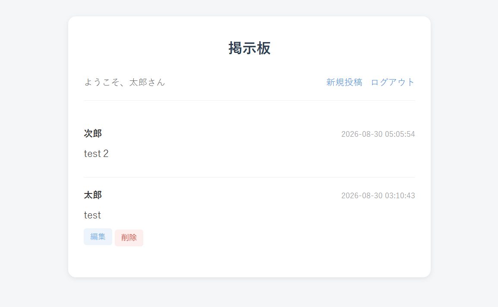
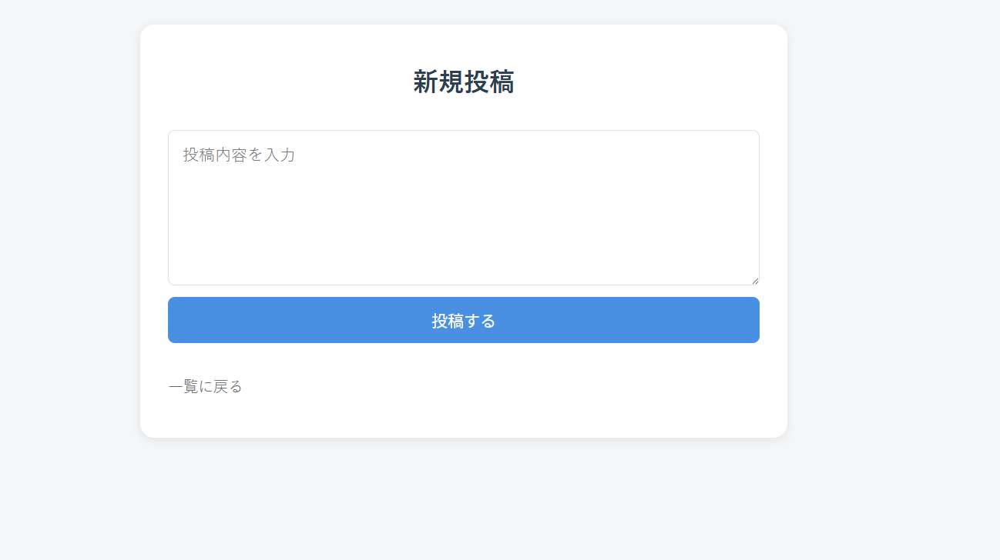

# BoardApp

PHP + MySQL(Docker)

会員登録・ログインをしたユーザー同士が、投稿を通じて交流できる、シンプルな掲示板アプリです。

PHPの基礎に加えて、認証機能・データベース操作(PDO)・権限管理を学ぶために、Laravelなどのフレームワークを使わず、素のPHPのみで作成しました。TODOリストアプリでの学習を踏まえ、その発展として実装しています。

## スクリーンショット

| 掲示板一覧画面 | 投稿画面 |
|---|---|
|  |  |

## 機能一覧

- 会員登録(パスワードはpassword_hash()でハッシュ化)
- ログイン・ログアウト(セッション管理、password_verify()による認証)
- 投稿の作成・一覧表示(投稿者名・投稿日時つき)
- 投稿の編集・削除(投稿した本人のみ操作可能)
- 入力内容のバリデーション(空白のみ入力・文字数超過をエラー表示)

本プロジェクトはDockerコンテナ(MySQL)上で動作します。PHP本体はDockerを使わず、内蔵サーバーで起動します。

## 環境構築

```bash
git clone git@github.com:kazuyuki-a-dev/board-app-php.git
cd board-app-php
docker compose up -d
```

MySQLコンテナの起動完了までに時間がかかることがあります。数秒待ってから下記のコマンドを実行してください。

```bash
docker compose exec db mysql -u board_user -p board_db -e "SHOW TABLES;"
```

`docker-compose.yml`の設定により、初回起動時に`database/schema.sql`が自動実行され、`users` / `posts`テーブルが作成されます。`users`・`posts`の2つが表示されれば準備完了です。

続けて、PHPサーバーを起動します。

```bash
php -S localhost:8000
```

ブラウザで以下にアクセスしてください。

```
http://localhost:8000/index.php
```

## 👤 テスト用ログインアカウント

環境構築後の動作確認用に、`register.php`から自由に新規登録できます。以下は動作確認済みのサンプルアカウントです。

| 項目 | 設定値 |
|---|---|
| メールアドレス | user@example.com |
| パスワード | 8文字以上の任意のパスワード |

## セキュリティ面で意識した点

- パスワードは`password_hash()` / `password_verify()`でハッシュ化・検証し、平文で保存しない
- SQL実行はPDOの`prepare()` / `execute()`(プレースホルダ)を使用し、SQLインジェクションを防止
- 投稿者情報(user_id)はフォームからではなく、サーバー側のセッション情報から取得し、なりすまし投稿を防止
- 投稿の編集・削除は、画面上でボタンを出し分けるだけでなく、各処理内でも「本人の投稿かどうか」をサーバー側で再検証

## 実行環境

**言語・ミドルウェア**
PHP 8.4(素のPHPのみ、フレームワーク不使用) / MySQL 8.0 / Docker, Docker Compose

**ホストOS**
Windows(WSL2 Ubuntu) / macOS / Linux(Dockerが動作する環境)

**推奨ブラウザ**
Chrome / Firefox / Edge(最新バージョン)

## 接続先一覧

Webサイト: http://localhost:8000/index.php

DB(コンテナ内、CLI接続): `docker compose exec db mysql -u board_user -p board_db`

## 🛠 データベース設計

各テーブル名をクリックすると、詳細なカラム構成を確認できます。

<details>
<summary>📘 users</summary>

| カラム名 | 型 | 説明 |
|---|---|---|
| id | INT | 主キー |
| name | VARCHAR(50) | ユーザー名 |
| email | VARCHAR(255) | メールアドレス(重複不可) |
| password | VARCHAR(255) | ハッシュ化済みパスワード |
| avatar | VARCHAR(255) | アカウント画像のパス(未実装、拡張用) |
| created_at | TIMESTAMP | 登録日時 |

</details>

<details>
<summary>📕 posts</summary>

| カラム名 | 型 | 説明 |
|---|---|---|
| id | INT | 主キー |
| user_id | INT | 投稿者(usersテーブルへの外部キー) |
| content | TEXT | 投稿内容 |
| created_at | TIMESTAMP | 投稿日時 |
| updated_at | TIMESTAMP | 更新日時 |

</details>

テーブル定義は [`database/schema.sql`](./database/schema.sql) にまとめています。

## ディレクトリ構成

```
board-app/
├── index.php             # 掲示板一覧画面
├── register.php          # 会員登録フォーム
├── register_process.php  # 会員登録処理
├── login.php              # ログインフォーム
├── login_process.php      # ログイン認証処理
├── logout.php              # ログアウト処理
├── post.php                 # 投稿フォーム
├── post_process.php         # 投稿処理
├── post_edit.php             # 投稿編集フォーム
├── post_update.php           # 投稿更新処理
├── post_delete.php           # 投稿削除処理
├── functions.php              # 共通処理(バリデーション関数)
├── db.php                      # PDO接続の共通処理
├── style.css                    # スタイルシート
├── database/schema.sql           # テーブル定義(users, posts)
├── docker-compose.yml             # MySQLコンテナの設定
└── images/                         # README用の画像
```

## 作成者

- 作成者: kazuyuki asari
- GitHub: https://github.com/kazuyuki-a-dev